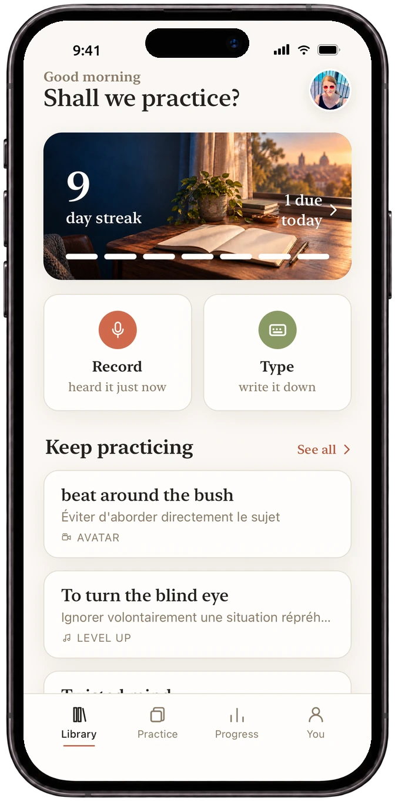

# Fooska — Catch the words worth keeping

**Fooska** is a mobile app for language learners who want to remember the expressions they actually hear — in movies, podcasts, and real conversations — instead of memorizing word lists that never stick.

Capture a phrase the moment you hear it, let Fooska enrich it with meaning and context, then lock it in with smart spaced-repetition practice. Available now on iOS.

🌐 **Website:** https://fooska.app
🍎 **App Store:** https://apps.apple.com/app/id6795742497

## Why Fooska

Traditional flashcard apps make you build decks from scratch and drill vocabulary you'll never use. Fooska flips that: you learn from the media you already love, capturing real expressions in seconds and reviewing only what's about to slip your memory.

## How it works

1. **Capture** — Hear a phrase you love? Tap record or type it in before it slips away. Fooska grabs it in seconds.
2. **Understand** — AI instantly fills in the meaning, a natural example sentence, and pronunciation — no dictionary hunting.
3. **Remember** — Smart spaced practice resurfaces each expression right before you'd forget it, so it sticks for good.

## Features

- **Voice & text capture** with live transcription and automatic AI enrichment (meaning, example, pronunciation).
- **Source tagging** — remember where you heard each expression, from a show to a friend.
- **Smart daily practice** — a bite-sized mix generated from exactly what's due: flashcards, listen-and-repeat, and fill-in-the-blank.
- **Pronunciation scoring** — record yourself and get accuracy, fluency and completeness back, with word-by-word feedback and half-speed playback.
- **Spaced-repetition engine** that learns your personal forgetting curve for maximum recall in minimum time.
- **Progress tracking** — streaks, a consistency heatmap, and a per-expression mastery breakdown.
- **Personal phrasebook** — every expression you've caught, searchable, sorted, and scored.
- **Two app-wide looks** — Calm Editorial and Alpine Focus, switchable any time from the You tab.

## Languages

Learn expressions in **English, Mandarin, Spanish, French, Portuguese, German, Japanese, Korean and Italian**, with meanings explained in whichever of them you're most comfortable in.

## Two minutes a day

Fooska is built around short, daily sessions. Keep your streak alive in about two minutes — practice that fits any day and actually compounds over time.

## Links

- [What's new](whats-new.html) — release notes and roadmap
- [Community](community.html) — forum, feature requests, and announcements
- [Privacy Policy](privacy.html)
- [Terms of Service](terms.html)
- Support: hello@fooska.app

---

© 2026 Fooska. Made for language lovers.
